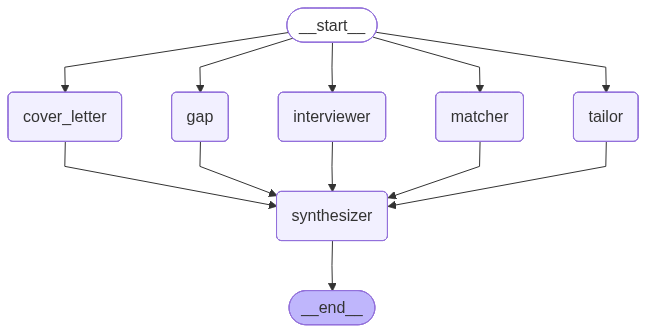

# 🔍 JobLens — AI Job Intelligence Platform

🟢 **[Try the live demo on Hugging Face Spaces →](https://huggingface.co/spaces/Danish-Ali99/joblens)**

A multi-agent AI platform that takes your **resume (PDF)** + a **job description**
and produces a complete application package in ~5 seconds:

- A **match score** with strengths and weaknesses
- A **skills gap analysis** with ranked priorities
- **Resume-tailoring suggestions** specific to this JD
- **Likely interview questions** with answer hints
- A **drafted, ready-to-send cover letter**
- A **24-hour action plan** synthesizing everything into next steps

Built with **LangGraph**, **LangChain**, a **RAG retrieval layer** (sentence-
transformers + FAISS), **pypdf**, and **Streamlit** — pluggable LLM backend
(Groq free tier or OpenAI).

---

## Architecture

**RAG layer:** The resume is chunked into paragraph-level pieces, embedded
with `sentence-transformers/all-MiniLM-L6-v2`, and indexed in FAISS. Each
specialist agent retrieves only the **top-k chunks most relevant to its role**
(e.g., the Skills Gap agent retrieves skills/education sections, the Cover
Letter Writer retrieves motivation/summary sections). The job description is
passed in full.

**Multi-agent layer:** Five specialist agents — **Match Analyst, Skills Gap,
Resume Tailor, Interview Coach, and Cover Letter Writer** — run **in parallel**.
A **Synthesizer** waits for all five and merges their outputs into a single
prioritized action plan.

The orchestration pattern is a classic LangGraph **fan-out / fan-in**: all
specialists are scheduled concurrently, the synthesizer is a join node that
only triggers after every parent has written to shared state.

## Features

- **RAG retrieval over chunked resume sections** — sentence-transformers + FAISS
  embed each chunk and each agent retrieves only what's relevant to its role
- **5 role-based agents** + Synthesizer, each with a tightly engineered system prompt
- **Parallel execution** via LangGraph's stateful graph (real concurrency)
- **PDF resume parsing** with `pypdf`
- **Streaming UI** that shows each agent's progress as it completes
- **Sample JDs** included (AI Engineer, Full-Stack, Business Dev) for quick demos
- **Markdown export** for the action plan and cover letter
- **Pluggable LLM backend** — switch between Groq (free) and OpenAI in a dropdown

## Tech Stack

| Layer         | Tool                                              |
| ------------- | ------------------------------------------------- |
| Orchestration | LangGraph                                         |
| LLM (free)    | Groq — `llama-3.1-8b-instant`                     |
| LLM (paid)    | OpenAI — `gpt-4o` / `gpt-4o-mini`                 |
| Embeddings    | sentence-transformers `all-MiniLM-L6-v2`          |
| Vector store  | FAISS (cosine similarity)                         |
| Framework     | LangChain                                         |
| PDF parsing   | pypdf                                             |
| UI            | Streamlit                                         |
| Lang          | Python 3.9+                                       |

## Quickstart

~~~bash
git clone https://github.com/Danish-Ali99/joblens.git
cd joblens

python -m venv .venv && source .venv/bin/activate
pip install -r requirements.txt

streamlit run app.py
~~~

Open http://localhost:8501, paste a Groq API key in the sidebar
(free at [console.groq.com](https://console.groq.com)), upload a resume PDF,
paste a JD, and click **Analyze fit**.

## Deploy your own in 2 minutes

JobLens deploys to [Hugging Face Spaces](https://huggingface.co/spaces) or
[Streamlit Cloud](https://share.streamlit.io) with zero config beyond a
single `GROQ_API_KEY` secret. The README YAML frontmatter on this repo
already configures the Space.

For HF Spaces, the `GROQ_API_KEY` goes in **Settings → Variables and secrets**.

## Project Structure

~~~
joblens/
├── agents/
│   ├── __init__.py
│   ├── base.py            # shared LLM factory + RAG-retrieval helper
│   ├── matcher.py         # Match Analyst
│   ├── gap.py             # Skills Gap Analyst
│   ├── tailor.py          # Resume Tailor
│   ├── interviewer.py     # Interview Coach
│   ├── cover_letter.py    # Cover Letter Writer
│   └── synthesizer.py     # 24-hour action plan
├── graph/
│   ├── __init__.py
│   ├── state.py           # TypedDict shared state
│   └── workflow.py        # LangGraph fan-out / fan-in DAG
├── utils/
│   ├── __init__.py
│   ├── pdf.py             # pypdf-based resume extraction
│   └── retriever.py       # sentence-transformers + FAISS RAG retriever
├── app.py                 # Streamlit UI
├── requirements.txt
├── .env.example
└── README.md
~~~

## How It Works

1. The user uploads their resume PDF. `pypdf` extracts plain text (multi-page,
   whitespace-normalized).
2. They paste a target job description (or click a sample).
3. **RAG indexing:** the resume is chunked by paragraph, each chunk is embedded
   with `sentence-transformers/all-MiniLM-L6-v2` (384-dim), and the embeddings
   are loaded into a FAISS index (cosine similarity).
4. LangGraph initializes shared state with the resume text, JD, and the FAISS
   retriever.
5. From the `__start__` node, LangGraph fans out to **5 specialist agents in
   parallel**. Each agent issues a role-specific retrieval query — e.g., the
   Skills Gap agent searches for "skills technologies tools certifications",
   the Cover Letter Writer searches for "summary motivation career goals" —
   and only the **top-k retrieved chunks** are placed into its prompt.
6. Once all 5 complete, the **Synthesizer** runs once and produces the action
   plan, with full context of every specialist's output.
7. The UI streams progress as each agent finishes and renders the action plan
   at the top with individual specialist reports in tabs.

## Extending It

- **Add an evaluation agent** — score the candidate's likelihood with an
  LLM-as-judge eval set.
- **Add resume rewriting** — produce a full, tailored PDF resume via LaTeX
  generation, not just bullet suggestions.
- **Add JD scraping** — paste a LinkedIn / Indeed URL and auto-extract the JD.
- **Persist sessions** — wire a Postgres / Supabase backend so users can
  compare multiple jobs against one resume.

## Why This Project

Built to demonstrate:

- Practical **agentic-AI patterns** — fan-out, fan-in, shared state, parallel
  orchestration.
- **Production-style structure** — typed state, modular agents, provider
  abstraction.
- **PDF input + structured-prompt outputs** — beyond toy "chat with a string" demos.
- A real **end-to-end product** — useful enough that the developer (me)
  literally uses it to apply to AI jobs.

## License

MIT
